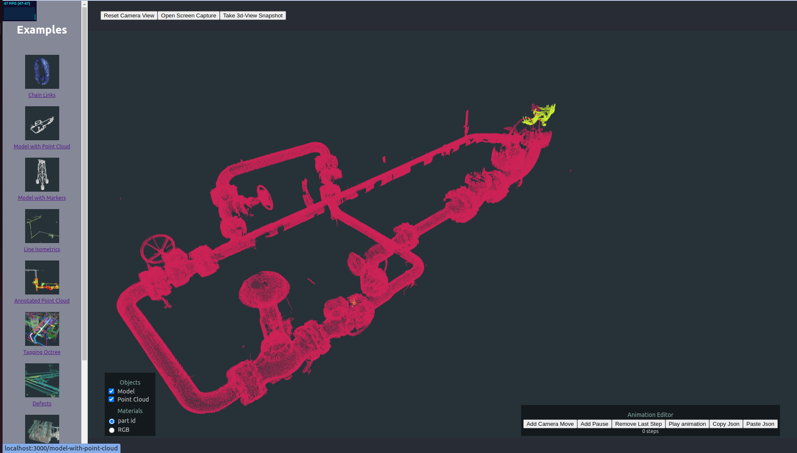

# What is Abyss 3D Viewer?

Abyss 3D viewer is an Abyss internal tool to view 3D models.
Nowadays, there are many different 3D models like csv, bin, octree format, and it is not convenient to open 3D model directly because it always involves some format conversion.

For instance, for CloudCompare, users first have to convert the model into a bin file that CloudCompare can understand.

The goal of Abyss 3D Viewer is to open all types of 3D model with a simple click.

    

Then people can install it and use it as a library.
